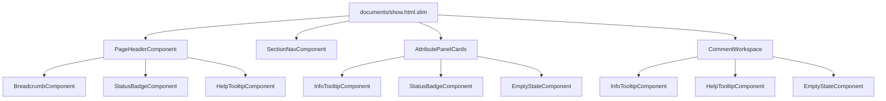

# Design Document: document-detail-ux

## Overview

文書詳細画面（`documents/show`）の UI/UX を、共通 ViewComponent 基盤・ナビゲーション構造の強化・ツールチップによる直感性向上を柱として改善する。

### 設計目標

1. **ViewComponent 基盤**: `app/components/` に再利用可能な UI 部品を整備し、テンプレート間の重複を排除
2. **ナビゲーション強化**: パンくず（階層位置）+ セクションナビ（ページ内ジャンプ）で長い詳細画面を操作しやすく
3. **直感性向上**: ステータスバッジ + ツールチップ + EmptyState で「次に何をすべきか」を UI が案内
4. **ヒーロー統一**: 2 分岐していたヒーロー領域を単一コンポーネントに統合
5. **属性パネル改善**: 折りたたみ一括からセクション別カードへ構造変更

### 対象範囲

- `app/components/` 新設（ViewComponent 群）
- `app/views/documents/show.html.slim` リファクタリング
- `app/views/documents/_detail_sections.html.slim` → セクション別カード化
- `app/frontend/controllers/section_nav_controller.ts` 新規作成
- CSS 拡張（ツールチップ、セクションナビ、ステータスバッジ）

---

## Architecture

### コンポーネント階層



### レイヤー構成

```
app/components/           # ViewComponent（表示のみ、業務ロジックなし）
├── info_tooltip_component.rb / .html.slim
├── help_tooltip_component.rb / .html.slim
├── page_header_component.rb / .html.slim
├── status_badge_component.rb / .html.slim
├── empty_state_component.rb / .html.slim
├── breadcrumb_component.rb / .html.slim
└── section_nav_component.rb / .html.slim

app/frontend/controllers/ # Stimulus（DOM 密着の小さな振る舞い）
└── section_nav_controller.ts

app/frontend/entrypoints/ # CSS 拡張
└── application.css       # ツールチップ、セクションナビ、バッジの追加スタイル
```

### 技術選定の根拠

| 判断 | 選定 | 理由 |
|------|------|------|
| コンポーネント | ViewComponent gem | Gemfile に既存。テスト可能、サーバーサイド完結 |
| ツールチップ | CSS-only (`:hover` + `:focus`) | JS 不要でアクセシブル。steering の方針に合致 |
| セクションナビ | Stimulus + IntersectionObserver | Turbo だけでは表現不可。DOM 密着の振る舞い |
| CSS | 既存 design system の拡張 | 新フレームワーク不要。CSS variables で統一 |
| パンくず | BreadcrumbComponent 新規 | 既存 `SourcePathBreadcrumb` は source_path 用。階層パンくずは別責務 |

---

## Components and Interfaces

### InfoTooltipComponent

```ruby
# app/components/info_tooltip_component.rb
class InfoTooltipComponent < ViewComponent::Base
  # @param label [String] 説明対象の用語（必須）
  # @param description [String] 補足説明テキスト（必須、最大200文字）
  def initialize(label:, description:)
    # ArgumentError if label or description is blank
  end
end
```

**レンダリング構造:**
```html
<span class="info-tooltip" tabindex="0" aria-label="[description]" aria-describedby="tooltip-[unique-id]">
  <span class="info-tooltip__trigger" aria-hidden="true">ℹ️</span>
  <span class="info-tooltip__content" id="tooltip-[unique-id]" role="tooltip">[description]</span>
</span>
```

### HelpTooltipComponent

```ruby
# app/components/help_tooltip_component.rb
class HelpTooltipComponent < ViewComponent::Base
  # @param description [String] 操作ガイドテキスト（必須、最大200文字）
  def initialize(description:)
    # ArgumentError if description is blank
  end
end
```

**レンダリング構造:**
```html
<span class="help-tooltip" tabindex="0" aria-label="[description]" aria-describedby="tooltip-[unique-id]">
  <span class="help-tooltip__trigger" aria-hidden="true">❓</span>
  <span class="help-tooltip__content" id="tooltip-[unique-id]" role="tooltip">[description]</span>
</span>
```

### PageHeaderComponent

```ruby
# app/components/page_header_component.rb
class PageHeaderComponent < ViewComponent::Base
  renders_one :breadcrumbs  # BreadcrumbComponent を受ける slot
  renders_many :actions     # action links/buttons

  # @param title [String] 画面タイトル（必須）
  # @param subtitle [String, nil] サブタイトル（任意）
  def initialize(title:, subtitle: nil)
    # ArgumentError if title is blank
  end
end
```

**レンダリング構造:**
```html
<header class="page-header">
  <div class="page-header__breadcrumbs">[breadcrumbs slot]</div>
  <h1 class="page-header__title">[title]</h1>
  <p class="page-header__subtitle">[subtitle]</p>
  <div class="page-header__actions">[actions slot]</div>
</header>
```

### StatusBadgeComponent

```ruby
# app/components/status_badge_component.rb
class StatusBadgeComponent < ViewComponent::Base
  # @param status [String] ステータスキー（visual tone class に変換）
  # @param label [String] 表示テキスト
  # @param tooltip [String, nil] ツールチップテキスト（任意）
  def initialize(status:, label:, tooltip: nil)
    # ArgumentError if status or label is blank
  end

  # status → CSS modifier class のマッピング
  STATUS_CLASSES = {
    "draft" => "status-badge--draft",
    "published" => "status-badge--published",
    "archived" => "status-badge--archived"
  }.freeze
end
```

**レンダリング構造:**
```html
<span class="status-badge status-badge--[status]" aria-label="[label]">
  [label]
  <!-- tooltip が指定されている場合 -->
  <span class="status-badge__tooltip" tabindex="0" aria-describedby="badge-tooltip-[id]">
    <span class="status-badge__tooltip-content" id="badge-tooltip-[id]" role="tooltip">[tooltip]</span>
  </span>
</span>
```

### EmptyStateComponent

```ruby
# app/components/empty_state_component.rb
class EmptyStateComponent < ViewComponent::Base
  renders_many :actions  # 推奨アクションリンク/ボタン

  # @param heading [String] 見出し（必須）
  # @param description [String] 説明テキスト（必須）
  def initialize(heading:, description:)
    # ArgumentError if heading or description is blank
  end
end
```

**レンダリング構造:**
```html
<div class="empty-state">
  <h3 class="empty-state__heading">[heading]</h3>
  <p class="empty-state__description">[description]</p>
  <div class="empty-state__actions">[actions slot]</div>
</div>
```

### BreadcrumbComponent

```ruby
# app/components/breadcrumb_component.rb
class BreadcrumbComponent < ViewComponent::Base
  # @param items [Array<Hash>] パンくずアイテム [{label:, url:}, ...]
  #   最後のアイテムは url: nil として current page 扱い
  def initialize(items:)
    # items は1件以上必要
  end

  # ラベルが200文字を超える場合に truncate するヘルパー
  def truncated_label(label)
    label.length > 200 ? label.truncate(200) : label
  end
end
```

**レンダリング構造:**
```html
<nav aria-label="パンくず" class="breadcrumb-nav">
  <ol class="breadcrumb-nav__list">
    <li class="breadcrumb-nav__item">
      <a href="[url]">[truncated_label]</a>
    </li>
    <li class="breadcrumb-nav__item" aria-current="page">
      <span title="[full_label_if_truncated]">[truncated_label]</span>
    </li>
  </ol>
</nav>
```

### SectionNavComponent

```ruby
# app/components/section_nav_component.rb
class SectionNavComponent < ViewComponent::Base
  MAX_TABS = 10

  # @param sections [Array<Hash>] [{id:, label:}, ...] 最大10件
  def initialize(sections:)
    @sections = sections.first(MAX_TABS)
  end
end
```

**レンダリング構造:**
```html
<nav class="section-nav" role="tablist" aria-label="文書詳細ナビゲーション"
     data-controller="section-nav">
  <a href="#[id]" role="tab" aria-controls="[id]" aria-selected="false"
     class="section-nav__tab" data-section-nav-target="tab">[label]</a>
  <!-- ... -->
</nav>
```

### section_nav_controller.ts（Stimulus）

```typescript
// app/frontend/controllers/section_nav_controller.ts
import { Controller } from "@hotwired/stimulus"

export default class extends Controller {
  static targets = ["tab"]

  declare tabTargets: HTMLAnchorElement[]
  private observer: IntersectionObserver | null = null

  connect(): void {
    this.setupObserver()
  }

  disconnect(): void {
    this.observer?.disconnect()
  }

  private setupObserver(): void {
    this.observer = new IntersectionObserver(
      (entries) => this.handleIntersection(entries),
      { rootMargin: "-0% 0% -70% 0%", threshold: 0 }
    )
    // 各 tab の aria-controls で指す section を observe
    this.tabTargets.forEach((tab) => {
      const sectionId = tab.getAttribute("aria-controls")
      const section = sectionId ? document.getElementById(sectionId) : null
      if (section) this.observer!.observe(section)
    })
  }

  private handleIntersection(entries: IntersectionObserverEntry[]): void {
    entries.forEach((entry) => {
      if (entry.isIntersecting) {
        this.activateTab(entry.target.id)
      }
    })
  }

  private activateTab(sectionId: string): void {
    this.tabTargets.forEach((tab) => {
      const isActive = tab.getAttribute("aria-controls") === sectionId
      tab.classList.toggle("is-active", isActive)
      tab.setAttribute("aria-selected", String(isActive))
    })
  }

  // Tab click → smooth scroll with offset
  tabTargets_click(event: Event): void {
    event.preventDefault()
    const tab = event.currentTarget as HTMLAnchorElement
    const sectionId = tab.getAttribute("aria-controls")
    const section = sectionId ? document.getElementById(sectionId) : null
    if (!section) return

    const navHeight = this.element.getBoundingClientRect().height
    const top = section.getBoundingClientRect().top + window.scrollY - navHeight
    window.scrollTo({ top, behavior: "smooth" })
  }
}
```

---

## Data Models

この機能はデータモデルの変更を伴わない。既存の `Document`、`DocumentVersion`、`Project`、`DocumentReviewComment` モデルのデータをそのまま ViewComponent に渡して描画する。

### コンポーネントへのデータフロー

```mermaid
flowchart LR
    Controller[DocumentsController#show] --> |@project, @document, @viewer_version| PH[PageHeaderComponent]
    Controller --> |sections array| SN[SectionNavComponent]
    Controller --> |@versions, @related_document_groups| AP[AttributePanel sections]
    Controller --> |@question_threads, @review_comments| CW[CommentWorkspace]

    PH --> |items: [{label, url}]| BC[BreadcrumbComponent]
    PH --> |status, label, tooltip| SB[StatusBadgeComponent]
    AP --> |status, label, tooltip| SB2[StatusBadgeComponent]
    AP --> |heading, description| ES[EmptyStateComponent]
```

### パンくずデータの組み立て

```ruby
# DocumentsController#show 内で組み立て
@hierarchy_breadcrumbs = [
  { label: @project.name, url: project_documents_path(@project) },
  if @viewer_version && params[:version_id].present?
    { label: @document.title, url: project_document_path(@project, @document.slug) }
  end,
  if @viewer_version && params[:version_id].present?
    { label: document_version_label(@viewer_version), url: nil }
  else
    { label: @document.title, url: nil }
  end
].compact
```

### セクションナビデータの組み立て

```ruby
# DocumentsController#show 内で組み立て
@section_nav_items = []
@section_nav_items << { id: "document-content", label: "本文" } if @viewer_iframe_src.present?
@section_nav_items << { id: "attributes", label: "属性" }
@section_nav_items << { id: "comments", label: "コメント" }
@section_nav_items << { id: "versions", label: "版一覧" }
@section_nav_items << { id: "related-documents", label: "関連文書" } if has_related_documents?
@section_nav_items << { id: "approval-requests", label: "確認依頼" } if current_user.internal?
```

---

## Correctness Properties

*A property is a characteristic or behavior that should hold true across all valid executions of a system — essentially, a formal statement about what the system should do. Properties serve as the bridge between human-readable specifications and machine-verifiable correctness guarantees.*

### Property 1: Tooltip accessibility invariant

*For any* InfoTooltipComponent or HelpTooltipComponent rendered with a valid description, the output HTML SHALL contain an element with `tabindex="0"`, an `aria-label` attribute whose value matches the description, and an `aria-describedby` attribute referencing a tooltip element containing the same description text.

**Validates: Requirements 1.1, 1.2, 1.6, 7.4**

### Property 2: Required parameter validation

*For any* ViewComponent (InfoTooltipComponent, HelpTooltipComponent, PageHeaderComponent, StatusBadgeComponent, EmptyStateComponent) instantiated with a nil or blank value for a required parameter, the component SHALL raise an `ArgumentError` indicating the missing parameter name.

**Validates: Requirements 1.8**

### Property 3: Breadcrumb final item invariant

*For any* BreadcrumbComponent rendered with one or more items, the last item in the ordered list SHALL have `aria-current="page"` and SHALL NOT be wrapped in a link element.

**Validates: Requirements 2.4**

### Property 4: Breadcrumb label truncation

*For any* breadcrumb item whose label exceeds 200 characters, the rendered text SHALL be truncated with ellipsis and the element SHALL have a `title` attribute containing the full original label text.

**Validates: Requirements 2.5**

### Property 5: Section nav tab limit

*For any* SectionNavComponent rendered with N sections where N > 10, the output SHALL contain at most 10 tab elements.

**Validates: Requirements 3.1**

### Property 6: Section nav ARIA roles

*For any* SectionNavComponent rendered with a list of sections, the container SHALL have `role="tablist"`, each tab SHALL have `role="tab"` and an `aria-controls` attribute matching the corresponding section's id, and exactly one tab SHALL have `aria-selected="true"`.

**Validates: Requirements 3.5**

### Property 7: StatusBadge tooltip presence

*For any* StatusBadgeComponent rendered with a non-nil tooltip parameter, the output SHALL include a tooltip element containing the tooltip text, accessible via `aria-describedby`.

**Validates: Requirements 4.3, 5.4**

### Property 8: FAB badge display logic

*For any* integer unresolved count, the Comment_Workspace FAB SHALL display a count badge if and only if the count is greater than zero. When the count exceeds 99, the displayed text SHALL be "99+" rather than the numeric value.

**Validates: Requirements 6.1, 6.2**

### Property 9: External user section exclusion

*For any* external user viewing the Document_Detail_Page, the rendered HTML SHALL NOT contain any of the following: 確認事項 tab, 確認事項投稿フォーム, 確認依頼作成フォーム, confirmation request table, drag-and-drop upload overlay, or handoff summary.

**Validates: Requirements 4.7, 8.4**

### Property 10: Attribute panel section id uniqueness

*For any* Attribute_Panel rendering, all section elements SHALL have unique `id` attribute values that correspond one-to-one with the Section_Nav tab `aria-controls` values.

**Validates: Requirements 5.2**

### Property 11: Navigation aria-label in Japanese

*For any* navigation element (Section_Nav, Breadcrumb, Comment_Workspace nav) rendered on the Document_Detail_Page, the `aria-label` attribute SHALL contain Japanese text describing the navigation purpose.

**Validates: Requirements 7.3**

---

## Error Handling

### コンポーネント初期化エラー

| コンポーネント | 必須パラメータ | エラー時の振る舞い |
|---------------|--------------|-------------------|
| InfoTooltipComponent | `label`, `description` | `ArgumentError` を raise（開発時に即発見） |
| HelpTooltipComponent | `description` | `ArgumentError` を raise |
| PageHeaderComponent | `title` | `ArgumentError` を raise |
| StatusBadgeComponent | `status`, `label` | `ArgumentError` を raise |
| EmptyStateComponent | `heading`, `description` | `ArgumentError` を raise |
| BreadcrumbComponent | `items`（1件以上） | `ArgumentError` を raise |
| SectionNavComponent | `sections`（1件以上） | 空配列の場合はコンポーネント自体を描画しない |

### データ欠損時のフォールバック

- パンくず: プロジェクトが存在しない状況はコントローラーの `require_project_access!` で事前にブロックされるため、コンポーネント側では考慮不要
- セクションナビ: セクションが 0 件の場合はナビ自体を描画しない（`render?` メソッドで制御）
- StatusBadge: 未知の status キーが渡された場合はデフォルトのニュートラルスタイル（`status-badge--unknown`）を適用
- EmptyState: actions slot が空の場合は actions 領域自体を描画しない

### Stimulus コントローラーのエラー耐性

- `section_nav_controller.ts`: `aria-controls` で参照した id の要素が DOM に存在しない場合、その tab は observer に登録せずスキップ
- IntersectionObserver 非対応ブラウザ: observer を作成せず、全 tab を初期状態（非アクティブ）のまま表示。クリックによるスクロールは動作する

---

## Testing Strategy

### テスト手法の使い分け

| テスト種別 | 対象 | ツール |
|-----------|------|--------|
| ViewComponent unit test | 各コンポーネントの描画結果 | RSpec + `render_inline` |
| Property-based test | コンポーネントの普遍的性質 | RSpec + `rantly` gem |
| Request spec | 画面全体の描画・権限制御 | RSpec request spec |
| Stimulus test | section_nav_controller の振る舞い | (手動検証 or 将来の JS test) |

### Property-Based Testing

この機能は ViewComponent のレンダリングロジックが中心であり、入力パラメータの組み合わせに対する普遍的な性質を検証する PBT が有効。

**使用ライブラリ:** `rantly` gem（Ruby 用 PBT ライブラリ）

**各テストの実行回数:** 最低 100 回

**タグ付けフォーマット:** `Feature: document-detail-ux, Property {number}: {property_text}`

各 Correctness Property に対して 1 つの property-based test を実装する。

### Unit Test（example-based）

以下の acceptance criteria は具体的なシナリオとして example-based テストで検証する:

- 2.2: デフォルト階層パンくずの具体的な構造
- 2.3: 版指定時のパンくず構造
- 3.6: 本文なし時にセクションナビから「本文」タブが除外される
- 4.2: ステータスバッジの具体的な表示
- 5.1: セクションカードの表示順序
- 5.5, 5.6: EmptyState の具体的なメッセージ内容
- 6.3, 6.4: ツールチップの具体的な説明テキスト
- 8.1, 8.2, 8.3: 状態パターンごとの画面構成

### Request Spec

権限制御とページ全体の構成を検証する:

- Internal admin が全セクションを閲覧可能
- External user が内部限定セクションを閲覧不可
- 版指定なし / 版指定ありでのパンくず変化
- 本文あり / なしでのレイアウト分岐
