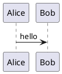
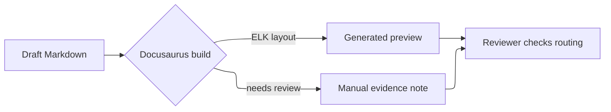

# Docusaurus build runtime notes

Docusaurus builds are executed in two paths:

- Rails seed/build flow for external sample documents
- Docusaurus renderer service for manual Markdown/MDX upload previews

## Node.js / npm

The seed build runner invokes `npm run build` under `docusaurus/`, so the execution environment must include Node.js and npm.

When the seed build command fails, the raised error includes the source directory, `DOCUSAURUS_DOCS_PATH`, `--out-dir`, optional `DOCUSAURUS_STATIC_DIR`, command shape, and separated stderr/stdout output. Use those fields to distinguish an input path problem from a build-output or static-asset problem before changing renderer behavior.

For local Docker development, rebuild the app image when npm is missing:

```bash
docker compose down -v --remove-orphans
docker compose build --no-cache app
docker compose run --rm app bash -lc "which node && node -v && which npm && npm -v"
```

Use `docker compose` consistently. Mixing the legacy `docker-compose` command with the v2 `docker compose` command can make it unclear which project/image is being used.

## Manual upload preview renderer

Manual Markdown/MDX uploads do not render HTML inside the Rails request. `ManualDocumentUpload` stores the draft `DocumentVersion` and enqueues `DocusaurusPreviewBuildJob`.

The job sends a `tar.gz` archive of the version's document files to the internal Docusaurus renderer API. The renderer builds with the repo-local `docusaurus/` configuration and returns a build artifact archive. Rails then expands the artifact under `storage/docs_sites/<version_id>/...` and updates `markdown_entry_path` / `site_build_path`.

`DocusaurusPreviewBuildJob` treats `.md`, `.markdown`, and `.mdx` as renderer targets. Non-Markdown versions, such as PDF or Office uploads, skip the renderer path and continue to use file viewers / side-by-side review.

For local development, enable the renderer compose file, and include Kroki when PlantUML / D2 diagrams should be rendered:

```bash
COMPOSE_FILE=docker-compose.yml:docker-compose.kroki.yml:docker-compose.docusaurus.yml
DOCUSAURUS_RENDERER_ENDPOINT=http://docusaurus:3000
KROKI_ENDPOINT=http://kroki:8000
```

The renderer container is built from local repository code rather than a generic public image because it depends on the repo-local Docusaurus config and `remark-kroki-diagrams` plugin.

The renderer has bounded input, output, and execution time. Tune these only when preview builds need larger document bundles:

```bash
DOCUSAURUS_RENDERER_MAX_UPLOAD_BYTES=20971520
DOCUSAURUS_RENDERER_MAX_OUTPUT_BYTES=52428800
DOCUSAURUS_RENDERER_BUILD_TIMEOUT_MS=60000
```

## Viewer HTML rewrite and table annotation

`DocusaurusSiteRenderer` rewrites internal links and asset URLs before returning HTML to Rails-side viewer routes. The same rewrite path also decides which chrome is removed for `embedded=1` responses and where portal-specific metadata can be added safely.

Current `main` includes a first slice for Markdown table follow-up work:

- standalone viewer responses annotate each real HTML `<table>` with `data-rails-table-preferences-table-key`
- the key is built from `DocumentVersion.public_id`, normalized `site_path`, and the per-page table index so multiple tables on the same page do not collide
- each annotated table is wrapped with `div.portal-doc-table-preference-wrapper` and matching `data-docs-portal-*` attributes so later UI/controller slices can target the table without reparsing the whole page
- Mermaid output and code blocks that merely contain table-like text are left untouched; only actual `<table>` nodes are annotated
- this first slice applies only to standalone viewer responses; `embedded=1` keeps the chrome-stripped body path and does not add table wrapper metadata yet

This is intentionally narrower than restoring the full `rails_table_preferences` UI inside Markdown pages. Column editors, saved resize controls, sticky rows/columns, and embedded-viewer parity remain follow-up work.

## Embedded viewer sizing

`documents/show` displays generated Docusaurus HTML through the `embedded=1` iframe path. The parent page owns the iframe sizing: `auto-height-frame` reads same-origin iframe content height after load and on content changes, then applies an explicit iframe height to reduce nested scrolling.

The CSS `min-height` remains the fallback for missing generated HTML, inaccessible iframe content, and very short pages. Keep viewer route contracts, Docusaurus renderer output, and manual upload state separate from this parent-page sizing behavior.

If a future embedded response cannot be measured from the parent page, prefer a small `postMessage` height payload from the embedded response before adding search UI or changing the standalone viewer chrome.

## Path safety and artifact lifecycle

Preview build inputs and outputs intentionally allow paths that normalize safely inside the site tree, such as `docs/../docs/guide.md`, while rejecting traversal, absolute, drive-letter, and NUL-containing paths.

The Rails side applies this boundary in three places:

- `DocusaurusPreviewArchiveBuilder` normalizes version file names before packing the source archive.
- `DocusaurusRendererClient` validates the renderer's `X-Docs-Site-Path` response header before installing the returned artifact.
- `DocusaurusPreviewArtifactInstaller` validates tar entries and checks that the expected entry HTML exists before replacing the current site directory.

The renderer service applies the same boundary before extracting the uploaded archive. It validates the `X-Docs-Entry-Path` header, rejects unsafe tar entries before extraction, and only returns a site path derived from the validated entry path.

Successful artifact install replaces the version's existing site directory atomically via a staging directory, so stale files from a previous build are removed. If validation fails before replacement, the existing site directory and metadata are left intact.

If the renderer request itself fails before an artifact is installed, `DocusaurusPreviewBuildJob` raises the error and leaves the existing `site_build_path` and site files unchanged. Transient renderer failures are retried by the job; validation failures surface for review without replacing the current preview.

Temporary archives returned from the renderer are closed by `DocusaurusPreviewBuildJob` after installation, including success and error paths.

## Kroki generated SVGs

Kroki-generated SVGs should not be treated as source files. They should be generated under the Docusaurus build workspace and then copied into `storage/docs_sites/<version_id>/...` as part of the built site output.

The Docusaurus config supports overriding the build workspace static directory with:

```bash
DOCUSAURUS_STATIC_DIR=/path/to/build/workspace/static
```

This value is used both by `remark-kroki-diagrams` as the SVG output directory and by Docusaurus `staticDirectories`, so generated SVGs are included in the returned build artifact without a separate HTML post-process step.

### Kroki smoke fixture

The representative smoke fixture is `docusaurus/plugins/remark-kroki-diagrams.smoke.test.mjs`. It uses this minimal PlantUML block:



Run the mocked smoke from the Docusaurus package directory:

```bash
cd docusaurus
npm run smoke:kroki
```

The smoke keeps Kroki optional by passing a mocked fetch implementation. It verifies that a configured endpoint posts to `/plantuml/svg`, writes the returned SVG under `generated/kroki`, and replaces the Markdown code node with an image URL pointing at that generated asset. The command above should pass without a running Kroki service, and it should not create source-controlled SVG artifacts.

When `KROKI_ENDPOINT` is not set, the expected behavior is a renderer failure that names the missing endpoint and source file. The normal Rails/RSpec suite should still pass without a running Kroki service because the smoke does not contact Kroki.

For a manual local smoke with the optional compose service, use the renderer and Kroki environment shown above, then run a preview/build with Markdown that includes the same PlantUML block. The generated build artifact should contain `generated/kroki/plantuml-*.svg`, and the rendered page should reference `/generated/kroki/plantuml-*.svg`. Do not commit the generated SVG.

## Mermaid / ELK visual evidence

Mermaid and ELK layout updates are Docusaurus renderer dependency changes, not Kroki plugin changes. Kroki coverage proves that external diagram code blocks are converted into generated SVG assets; it does not prove that Mermaid's in-browser rendering, ELK edge routing, or Mermaid layout defaults still look acceptable after a dependency bump.

When a Docusaurus Dependabot PR also includes `Maintainer changes` or `Install script changes`, first use [Docusaurus Dependabot review gate](./docusaurus-dependabot-review-gate.md) for the package metadata and install script manual evidence. Then use this section only for the rendering-impact side, such as Mermaid / ELK layout changes, routed edges, labels, or diagram defaults.

For Dependabot or manual Docusaurus dependency updates that mention Mermaid rendering, ELK layout, edge routing, diagram shapes, label placement, or renderer defaults, keep the first gate as manual visual evidence unless the issue explicitly asks for CI automation. Add the evidence to the PR conversation as a screenshot or short confirmation note, and include the dependency name/version, fixture used, viewport or browser, and whether the rendered edge routing and labels were readable.

Use this representative Markdown fixture when ELK routing is in scope:



This fixture is intentionally small. It should make routed edges, branch labels, and node spacing visible without turning the check into a full visual regression suite. If a dependency release specifically mentions mindmap layout or another Mermaid diagram type, add one temporary local fixture for that release note while keeping the PR evidence to one or two representative diagrams.

Do not commit generated screenshots, generated SVGs, or rendered HTML artifacts for this check. If a future issue moves this into `docs-quality`, keep it lightweight: a build-or-render smoke for the representative fixture is acceptable, but pixel diffs, browser screenshot infrastructure, all-page visual scans, and Docusaurus build profile redesign belong in separate issues.
